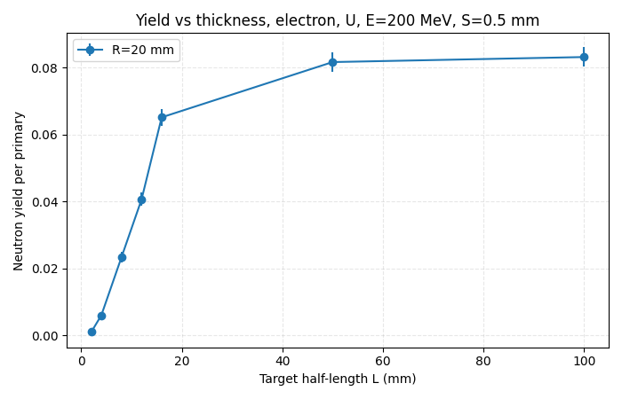
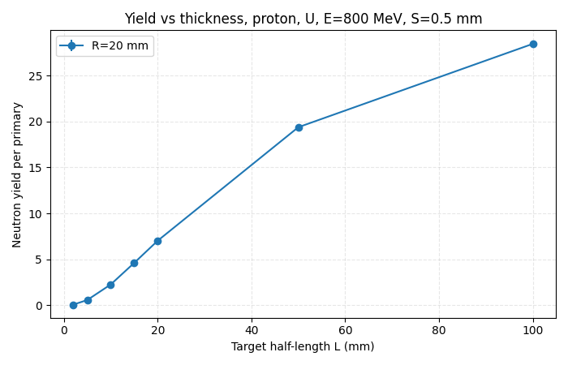

# Geant4 Neutron Yield Study

[Українська версія](README.uk.md)

A reproducible Geant4 study of neutron escape yield from electron and proton beams incident on cylindrical natural-uranium and tungsten targets. Python utilities automate parameter scans, aggregate Monte Carlo outputs, plot yield trends, and fold neutron spectra with TALYS cross sections for exploratory transmutation estimates.

> Research status: the code has been cleaned and audited for public release. The bundled figures come from the later successful run found in the project archive, not from the earlier failed U/W-identical run. They were produced before the boundary-tally correction in this release and are therefore reference artefacts, not validated benchmark results. Regenerate them before scientific citation.

## What is included

- Geant4 C++17 application with configurable beam, energy, target material and geometry;
- serial execution for deterministic, race-free counters and output files;
- automated electron/proton parameter sweeps;
- yield tables, uncertainty estimates and publication-ready plots;
- exploratory transmutation pipeline for ¹²⁹I, ¹³⁵Cs and ²⁴¹Am;
- a minimal, repository-contained subset of TALYS 2.0 generated tables;
- bilingual documentation, tests and a lightweight Python CI workflow.

## Reference results from the successful archived run

All values below use a target radius of 20 mm, 10,000 primary particles per point and `L` as the Geant4 target **half-length** (the full cylinder length is `2L`). Statistical uncertainty is the stored Poisson estimate.

| Beam | Energy | Material | L | Escaping neutrons / primary |
|---|---:|---:|---:|---:|
| electron | 200 MeV | natural U | 100 mm | 0.0831 ± 0.0029 |
| electron | 200 MeV | W | 100 mm | 0.0451 ± 0.0021 |
| proton | 800 MeV | natural U | 100 mm | 28.4551 ± 0.0533 |
| proton | 800 MeV | W | 100 mm | 12.5985 ± 0.0355 |





The full sanitized tables are in [`docs/results/reference/tables`](docs/results/reference/tables). These data show the expected strong increase with proton energy and generally larger yield for natural uranium than tungsten in the successful run. They remain provisional because the archived executable counted only radial-shell crossings; this release counts the first escape through any target surface.

## Build and run

Requirements:

- CMake 3.16 or newer;
- a C++17 compiler;
- Geant4 with UI, visualization and analysis components;
- Python 3.10 or newer for analysis.

```bash
cmake -S . -B build
cmake --build build -j
python -m pip install -r requirements.txt
./build/neutron_yield macros/electron_200_U.mac
```

Preview the full scan without running Geant4:

```bash
python run_scan.py --dry-run --beam electron --material U
```

Run the simulation and yield analysis:

```bash
python run_scan.py --executable build/neutron_yield --out results --nprimary 10000
python analysis/analyze_yield.py --in results --out out
```

Or use `./run_full_pipeline.sh`. The complete transmutation stage additionally requires the Geant4 spectra referenced by `analysis/configs`.

## Repository layout

```text
src/, include/             Geant4 application
macros/                    example and scan macros
run_scan.py                parameter sweep driver
analysis/                  yield and transmutation analysis
analysis/data/talys/       minimal generated TALYS tables
tools/talys/               TALYS input-generation/extraction helpers
docs/results/reference/    successful archived run, sanitized
tests/                     Python smoke and data-parser tests
```

## Important interpretation notes

- `L_mm` is a half-length, despite legacy filenames referring to “thickness”.
- One neutron track is counted once, on its first crossing from the target to another volume.
- The application intentionally runs in serial mode; the original per-thread counters and common output names were unsafe under multithreading.
- Transmutation product half-lives in the JSON files are scenario inputs inherited from the working project. Verify them against an evaluated nuclear-data source before scientific or engineering use.
- The model is intended for research and education, not radiation-safety, shielding, medical or regulatory decisions.

See [`docs/CODE_AUDIT.md`](docs/CODE_AUDIT.md) for the release audit and known limitations.

## License and data provenance

The source code and documentation are released under the [MIT License](LICENSE). The numerical files under `analysis/data/talys` are generated TALYS 2.0 outputs and are included only to make the parser examples reproducible; they are not relicensed by the MIT license. See their [provenance note](analysis/data/talys/README.md).


